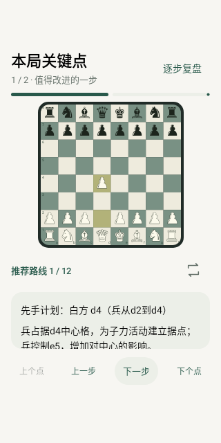

# 弈步 0.8.1

[APK 下载页面](https://github.com/well49112/yibu-chess/blob/apk-downloads/yibu-0.8.1-arm64.apk) · [版本说明](https://github.com/well49112/yibu-chess/releases/tag/v0.8.1)

## 改动

- 音效改为接近 Chess.com 风格的清脆落子、低沉吃子与两次易位触板声，缩短将军提示。全部 19 类声音为项目原创合成，内置离线，始终开启，跟随手机媒体音量。
- 讲解说明实战为什么有问题、对手的具体反击、受攻击棋子的格子、能否回吃，以及实战与推荐路线的子力变化。单独解释漏防将杀、错过将杀，等值交换不会仅因回吃被描述为亏子，未确认的评价会提示。
- 每着注释增加棋盘事实和下一着应对。全局复盘每个关键点从最多 3 着增加至最多 16 着（8 回合），在实战落子画面也能阅读失误原因；逐步、倒退、切换节点均由手动按钮控制。
- 打开旧讲解时复用保存的分析，本地更新文字；重新复评导致分析变化时移除过期讲解，避免最佳走法相同却继续展示旧的失误解释。

棋盘演示只使用引擎返回的合法参考变化，短变化、非法后缀或将杀会提前停止，不填造棋步。说明基于棋盘事实与主变化，并非引擎战略判断的完整解释。

## 安装

同包名 `cn.yibu.chess`、原个人签名，versionCode 14，可覆盖安装保留棋谱、个人 Elo 与设置。Stockfish 分析和最强对手沿用 0.8.0 远端服务与原 Access Token；匹配 Maia 对弈仍可离线。

## 本版针对性验证

| 范围 | 通过检查数 |
| --- | ---: |
| 失误解释：白黑视角、丢后、将杀、等值交换、吃过路兵、缺失变化、未确认评价及缓存版本 | 10 |
| 长变化、逐着注释、旧记录兼容、终局截断 | 4 |
| 开局、吃子、易位、合法后缀与讲解序列化 | 6 |
| 全局关键点选择与排除旧/未确认评价 | 2 |
| 19 类 PCM 资源、短促衰减、无削波、后台取消与不补播旧声 | 4 |
| 旧讲解离线更新、同最佳走法复评后失误文字失效 | 2 |
| 小屏手动走完 12 着、倒退/换点、讲解滚动时保留棋盘与按钮 | 2 |
| 合计 | 30 |

使用 Android 15 Robolectric/Compose 与 JVM 棋盘规则验证；构建原签名 ARM64 release APK。未运行全量回归、全量 lint，也未在 Xiaomi 17 Pro 真机或朋友的生产服务上重新联调。GitHub 上传成功后直接交付下载页面，不重复下载验证。
