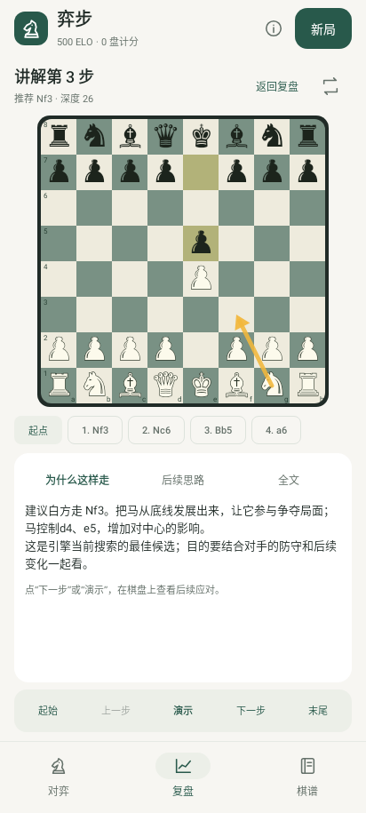
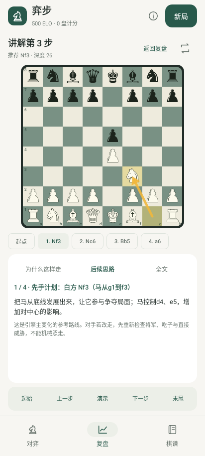
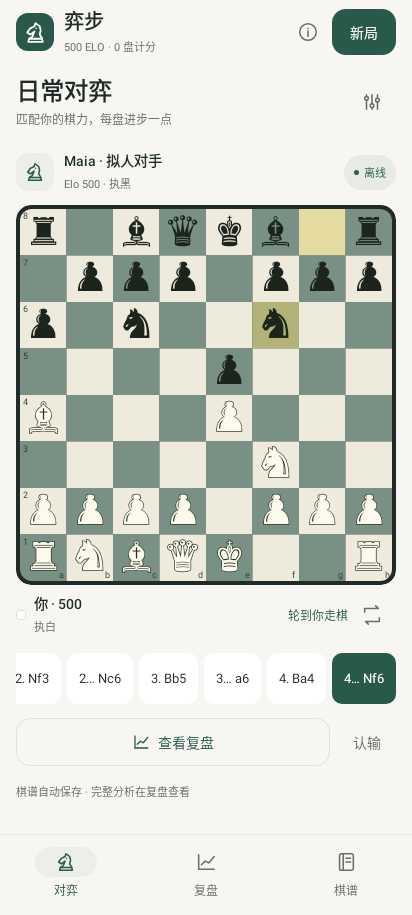
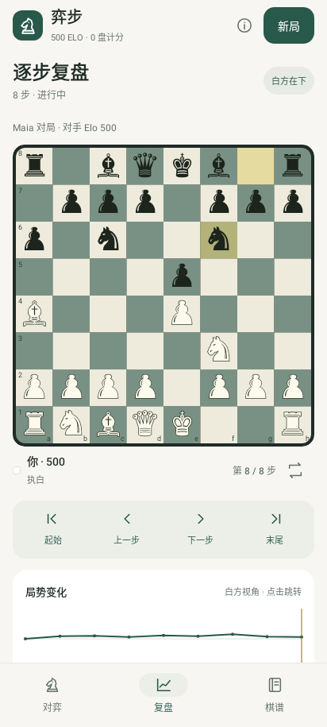
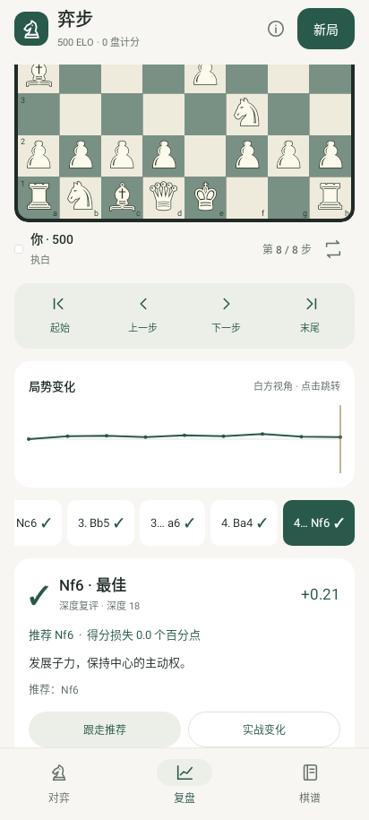
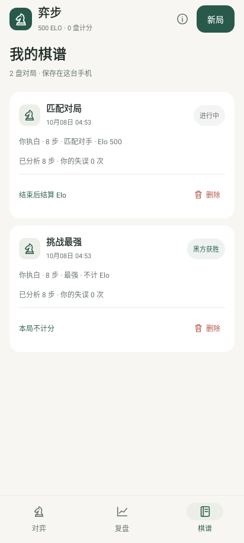
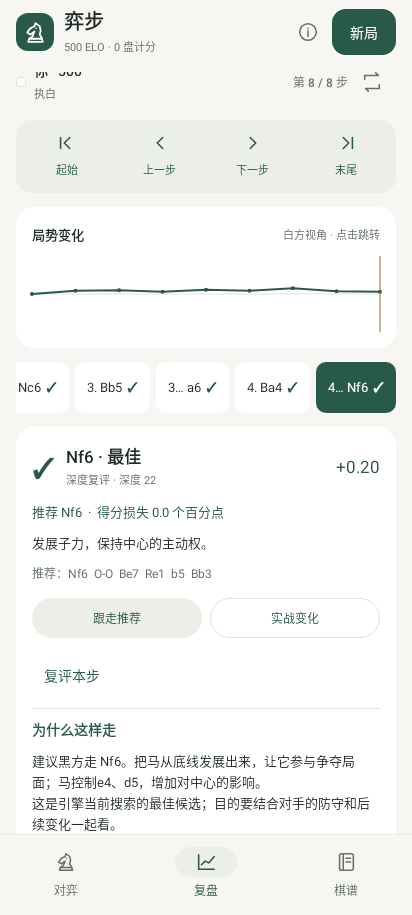
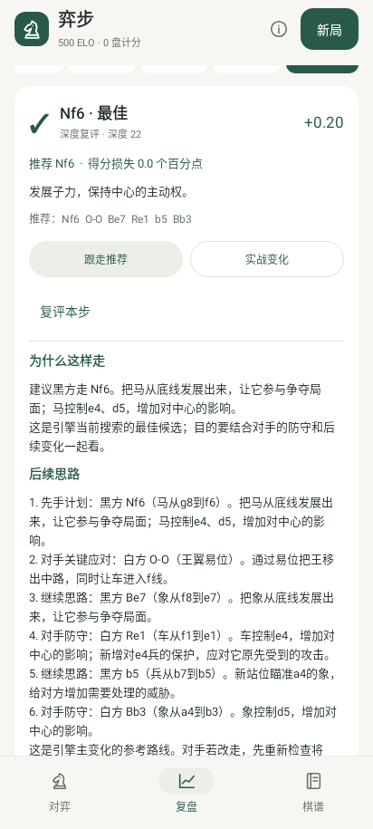

# 弈步 0.6.0 棋盘讲解

沿用已安装的 [Emil 设计技能](../.agents/skills/emil-design-eng/SKILL.md)。单步讲解直接在复盘内展开：棋盘固定在上方，说明区域单独滚动，底部跟走操作固定可见。

| Before | After | Why |
| --- | --- | --- |
| 阅读长讲解时棋盘滚出屏幕 | 固定棋盘，文字只在下方区域内滚动 | 阅读原因时仍能对照局面 |
| 后续思路是一大段走法列表 | 每着对应棋盘、箭头、移动说明和解释，支持前后步进及自动演示 | 将文字和实际变化直接对应 |
| 推荐原因与全文分散在页面下方 | “为什么这样走”“后续思路”“全文”集中在同一界面 | 保留所有文字，避免缩小字体硬塞内容 |
| 已深度分析过仍重复搜索生成讲解 | 复用有效深度结果，旧讲解本地补全逐着说明 | 减少等待，旧棋谱继续可用 |

棋盘大小随可用高度调整；保留原生 250ms 棋子位移。每着演示后说明同步切换；自动演示可暂停，手动操作立即接管。返回复盘保留原实战棋步。只检查本次改动涉及的缓存、注释、同屏演示、长文滚动和小屏操作，没有运行全量 UI 回归。

---

# 弈步 0.5.0 界面

为个人离线国际象棋练习设计，第一优先级是看清棋盘、识别回合，并顺利进行下一步。无需开始问卷；新局沿用已有随机执棋或手动偏好。

本次应用 [.agents/skills/emil-design-eng/SKILL.md](../.agents/skills/emil-design-eng/SKILL.md)，上游固定为 e8a175de22ae1e49370fc144c1f3bb9aeedf988d。CSS 示例对应的原则通过原生 Jetpack Compose 实现，不引入网页或 React 运行时。

| Before | After | Why |
| --- | --- | --- |
| 深色页面、多层说明占据棋盘上方 | 暖白底色、墨绿重点色，双方信息直接贴近棋盘 | 提高棋盘的视觉优先级，简化回合识别 |
| Unicode 导航图标 | 同一笔画规格的自有矢量图标 | 在不同 Android 字体上保持一致 |
| 每步自动动画滚动棋步条 | 高频操作即时定位 | 避免每一回合额外等待和位移 |
| 按钮缺少按压形变 | 偶尔使用的主要按钮 0.97 倍轻微反馈 | 确认触摸，按下 120ms、释放 80ms，使用 ease-out 曲线 |
| 复盘按钮和长文案争夺横向空间 | 大触摸目标的步进条，推荐和实战入口各占一半宽度 | 在 320dp 小屏仍可操作，长说明可滚动 |
| 落子立即跳到终点 | 棋子 250ms 平移，吃子淡出，快速反向不中断位置连续性 | 明确连接前后局面，保留自然落子节奏 |
| 复盘只有评级和短变化 | 按步生成走法原因、关键应对和后续思路，可跟走 | 把引擎变化转为可理解的训练信息 |
| 所有棋谱一次创建 | LazyColumn 按需绘制，有记录和空列表各有明确状态 | 保存更多对局时保持流畅 |

## 视觉规则

背景 #F7F6F2，正文 #202B27，重点色 #28594B，辅助正文 #65716A，卡片白色。棋盘保留浅米白、低饱和绿和金色最后一步提示。中文使用系统字体；不依赖在线字体、图片或图标下载。主间距为 8 / 12 / 16 / 24dp，常用图标按钮触摸区域 48dp。内容最大宽度 560dp，宽屏居中；小屏可纵向滚动。

棋盘采用 250ms 棋子移动动画；用户明确要求此高频操作保留位移，用于连接前后局面。应用 [.agents/skills/animate/SKILL.md](../.agents/skills/animate/SKILL.md)，只在相邻合法局面间平移棋子和淡出吃掉的子，使用 `cubic-bezier(0.77, 0, 0.175, 1)`。动画值在 graphicsLayer 中读取，棋盘背景不逐帧重绘，复盘中途反向从当前视觉位置继续。王车易位同时移动两枚棋子，吃过路兵使用实际吃子格，升变到达后更换字形。翻面、新局、跨步跳转与系统关闭动画时直接落位；手势仍读取 rememberUpdatedState 的最新回合回调。主要按钮的 graphicsLayer 缩放由 Compose 动画驱动，遵循系统动画时长比例（包括关闭动画）；底部导航与弹窗使用原生 Material 控件反馈。页面切换不添加整屏动画。

## 验证

UiLayoutTest 导出实际 Compose 渲染到 artifacts/ui-0.5.0，覆盖 412dp 白黑棋盘、复盘曲线及分析卡、单步讲解两部分、棋谱与空列表、320dp 设置与长复盘文本。ChessMotionTest 检查移动中间帧、快速倒放连续性、易位双子、翻面／新局中断与关闭动画。ChessBoardTest 和 PlayInteractionTest 保留过期点击状态回归以及真实 Maia / 同源 Stockfish 的连续对弈检查。单元渲染不等同于 Xiaomi 真机触感验收。

## 原生渲染预览

以下为 412dp 手机布局的 Compose 原生渲染，使用示例棋谱，不包含系统状态栏。

 

 

 
